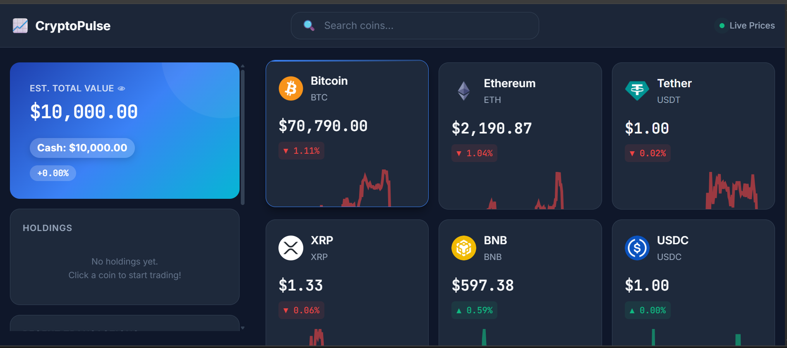

# CryptoPulse
A professional cryptocurrency price tracker with paper trading simulation. Built with vanilla HTML, CSS, and JavaScript as a portfolio project demonstrating modern frontend architecture.


## 🚀 Live Demo
👉 https://cryptopulse-d.netlify.app/


## 📸 Preview



## ✨ Key Highlights
- Built with modular architecture (no frameworks)
- Real-time API integration with caching
- Interactive charts and portfolio simulation


## Features
- **Live Price Data**: Real-time cryptocurrency prices via CoinGecko API
- **Interactive Charts**: 7-day, 30-day, and 1-year price history (Chart.js)
- **Paper Trading**: Virtual portfolio with $10,000 starting balance
- **Portfolio Analytics**: Allocation pie chart and profit/loss tracking
- **Favorites System**: Save preferred coins to localStorage
- **Search & Filter**: Real-time coin search
- **Responsive Design**: Mobile-first, works on all devices
- **Modern UI**: Dark theme with smooth animations


## Tech Stack
- **Frontend**: HTML5, CSS3 (CSS Variables, Flexbox, Grid), Vanilla JavaScript (ES6+)
- **Charts**: Chart.js via CDN
- **API**: CoinGecko (free tier)
- **Storage**: LocalStorage for persistence
- **Fonts**: Inter (UI), JetBrains Mono (numbers)


## Project Structure
```
CryptoPulse/
├── index.html              # Single entry point
├── css/
│   ├── reset.css           # Browser normalization
│   ├── variables.css       # Design tokens
│   ├── layout.css          # Grid and responsive utilities
│   ├── components.css      # Reusable UI components
│   ├── animations.css      # Transitions and keyframes
│   └── main.css            # Aggregator
├── js/
│   ├── config.js           # Constants and utilities
│   ├── store.js            # State management
│   ├── api.js              # API calls and caching
│   ├── ui.js               # DOM manipulation
│   ├── components.js       # HTML generators
│   ├── chart.js            # Chart.js integration
│   ├── portfolio.js        # Trading logic
│   └── app.js              # Main application
└── README.md
```

## Architecture Highlights
- **Modular Design**: Each JS file has a single responsibility
- **State Management**: Centralized store pattern with LocalStorage persistence
- **API Layer**: Centralized fetch logic with caching and retry mechanisms
- **Component Pattern**: Reusable HTML generators for consistent UI
- **Separation of Concerns**: Business logic (portfolio) separate from UI


## Getting Started
1. Clone or download the repository
2. Open `index.html` in a modern browser
3. No build tools required - runs entirely in the browser
4. Internet connection required for API data


## API Limits
This project uses CoinGecko's free tier:
- Rate limit: ~10-30 calls/minute
- Data updates: Every 1-2 minutes
- No API key required for basic endpoints


## Browser Support
- Chrome/Edge (last 2 versions)
- Firefox (last 2 versions)
- Safari (last 2 versions)
- Mobile browsers (iOS Safari, Chrome Mobile)


## Future Enhancements
- [ ] Real-time WebSocket price updates
- [ ] User authentication for cloud sync
- [ ] Advanced chart indicators (RSI, MACD)
- [ ] News feed integration
- [ ] Price alerts/notifications


## License
MIT License - Open for learning and personal use.
---


**Built by**: Dasola Ebere                 
**Date**: 2026  
**Purpose**: Frontend Portfolio Project
